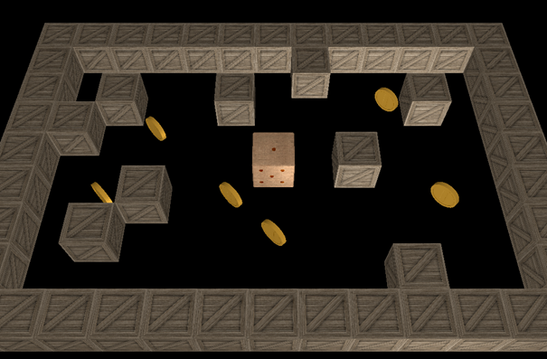

# Cubic Conundrum
A 3D puzzle game built with Vulkan and C++.

## Prerequisites
- Vulkan SDK 1.4.x
- Visual Studio 2022 or later
- GLFW 3.2.1+
- GLM

## Building
1. Install Vulkan SDK from https://vulkan.lunarg.com/
2. Download GLFW from https://www.glfw.org/
3. Clone this repo
4. Update include paths in cubicConundrum.cpp
5. Update paths in cubicConundrum.cmd
6. Run: `.\cubicConundrum.cmd`

## Controls
- WASD: Move the dice
- Goal: Collect all coins to open the exit

