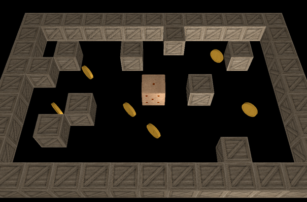

# Cubic Conundrum

A 3D puzzle game written in C++ with Vulkan. You roll a die around a grid — it
keeps sliding in the direction you picked until it hits a wall.

## How to play

- **WASD** to roll the die. It slides until it hits a wall and then stops.
- You can only pick a new direction once the die has stopped, so you have to
  think about where you'll end up before you move.
- Collect all the coins to open the exit, then reach it to win.
- The die rotates so that its top face shows your current score.

## Tech

C++ with the Vulkan API. The renderer covers the usual setup — instance,
swapchain, render pass with depth, descriptor sets for uniform buffers and
texture samplers, staged vertex / index / texture buffers, command buffers, and
frame synchronization. Built on GLFW, GLM, tinyobjloader, and stb_image.

## Building

1. Install the [Vulkan SDK](https://vulkan.lunarg.com/) from LunarG.
2. Download [GLFW 3.2.1 or newer](https://www.glfw.org/).
3. Clone the repo.
4. Point the GLFW and GLM include paths in `cubicConundrum.cpp` at your local
   copies.
5. Update the paths in `cubicConundrum.cmd`.
6. Run `.\cubicConundrum.cmd`.
